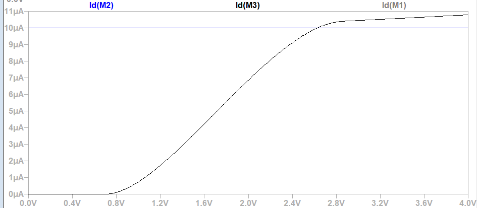
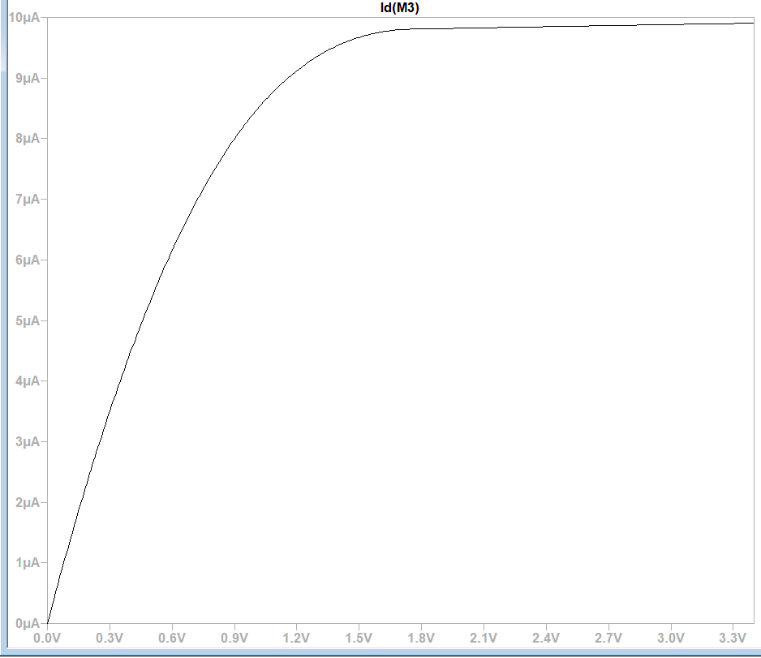

## Low Voltage Cascode Current Mirror vs Conventional Current Mirror

This project presents the **design**, **simulation**, and **performance comparison** of two commonly used current mirrors in analog circuit design:

- **Basic (Conventional) Current Mirror**
- **Low Voltage Cascode Current Mirror (LVCCM)**

---
  Tools Used: LTspice XVII
-

## What is a Current Mirror?
A current mirror is a circuit designed to **copy (or mirror)** a current from one active device to another, maintaining a **constant current** regardless of the loading. Current mirrors are fundamental in analog integrated circuits for **biasing**, **active loads**, and **signal processing**.

## Why Improve the Basic Mirror?
The basic current mirror, while simple, suffers from **low output resistance** and is sensitive to **channel length modulation**, which leads to **inaccurate current copying**, especially in low-voltage or high-gain environments.

To address these issues, **cascode and low-voltage cascode structures** are used to improve accuracy, **reduce output conductance**, and make the mirror suitable for **modern low-voltage CMOS technologies**.

---

##  Conventional cascode Curent Mirror

The conventional current mirror consists of **three NMOS transistors** (typically M1 and M2).
- Simple and compact
, Low power consumption
, Easy to implement
- Low output resistance (~ kΩ)
, Requires high voltage headroom: VGS + VDS(sat)
, Affected by channel length modulation (λ ≠ 0) ,
Limited precision for analog applications

##  Schematic

##  Output

---

##  Low Voltage Cascode Current Mirror (LVCCM)

The LV Cascode mirror enhances the basic structure by adding **two more NMOS transistors** and a **biasing voltage**, forming a cascode configuration.

## Benefits
- **High output resistance** (~hundreds of kΩ)
- **Low voltage operation** (suited for modern CMOS tech)
- **more Accurate current replication**
- **Minimized channel length modulation**
##  **cons**:
- Higher design complexity
- Slightly increased power consumption

#  Schematic

## Output Waveform

---

##  Comparison Table

| Feature                        | Conventional Current Mirror | LV Cascode Current Mirror |
|-------------------------------|-----------------------------|----------------------------|
| **Structure**                 | 3 NMOS                      | 4 NMOS + Biasing           |
| **Output Resistance**         | Low ( ~kΩ)                 |             ~120kohms    |
| **Voltage Headroom Required** | High (VGS + 2VOV) | 2VOV   |
| **Channel Length Modulation** | Significant                 | Strongly suppressed        |
| **Current Replication Accuracy** | Moderate                | High                       |
| **Power Consumption**         | Low                         | Moderate                   |
| **Design Complexity**         | Simple                      | Moderate                   |
| **Applications**              | General-purpose, low-precision | Precision analog, low-voltage |

---

# Files Included

- `Simple_Mirror.asc` – LTspice schematic of basic current mirror
- `LV_Cascode_Mirror.asc` – LTspice schematic of cascode mirror
- Simulation results (screenshots above)
-**References** - Bezaad Razavi
---

